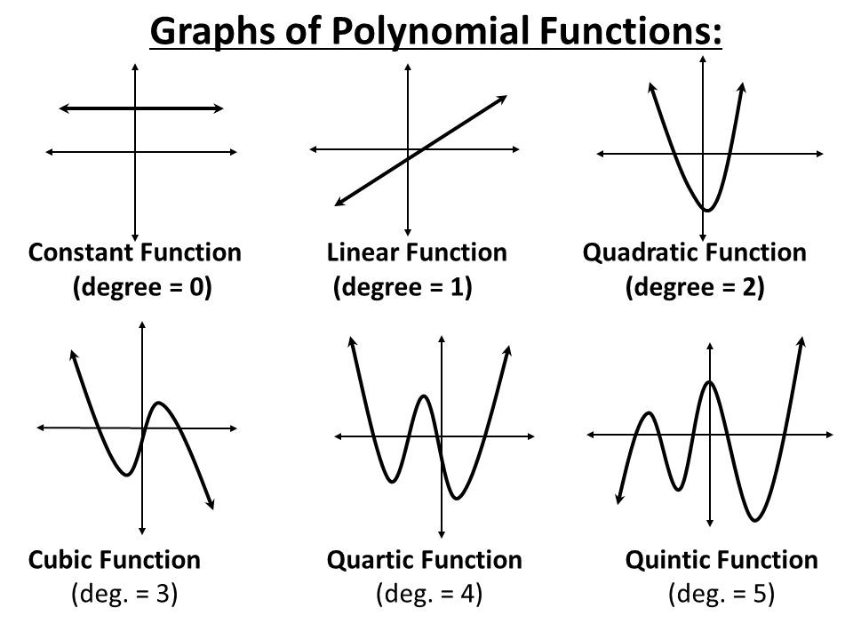
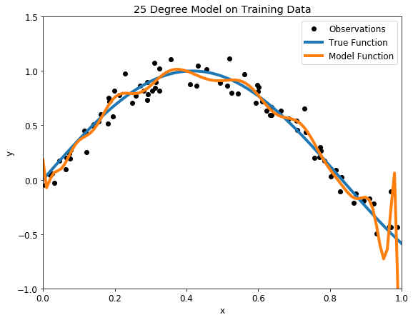

# Data Scientists and Machine Learning #

## Two Categories of Challenges ##

There are two categories of challenges that machine learning practitioners and data scientists face: bad algorithms and bad data. 

**Bad algorithms** can come from: 

- Poor feature engineering
- Poor feature selection or poor feature extraction
- Overfitting the training data — the model performs well on the training data alone but doesn't generalize well to unseen data
- Underfitting the training data — your model is too basic to learn the underlying structure of the data
- Failure to properly cross-validate — cross-validation gives you sensible hyperparameters, but you can easily misapply this technique — you'll learn more about this later 

**Bad data** can arise for many reasons. These include: 

- Nonrepresentative training data — the training data is not representative of the new cases to which you want to generalize
- Sampling bias exhibited by the data
- Poor-quality data — errors, outliers, and noise (due to poor-quality measurements). 

## Dealing with the Lack of Data in Machine Learning ##

The problem of data scarcity is very important since data are at the core of any AI project.

Supervised machine learning models are being successfully used to respond to a whole range of business challenges. However, these models are data-hungry and their performance relies heavily on the size of training data available. In many cases, it is difficult to create training datasets that are large enough.

**How much data do I need?**

Well, you need roughly 10 times as many examples as there are degrees of freedom in your model.

**Overfitting:** refers to a model that models the training data too well. It happens when a model learns the detail and noise in the training data to the extent that it negatively impacts the performance of the model on new data.

In general, different machine learning algorithms can be used to determine the missing values. This works by turning missing features to labels themselves and now using columns without missing values to predict columns with missing values.

Based on my experience, you will be confronted with a lack of data or missing data at some point if you decide to build an AI-powered solution, **but fortunately, there are ways to turn that minus into a plus.**

**Lack of data?**

The very nature of your project will influence significantly the amount of data you will need.

- **Number of categories to be predicted**
  - What is the expected output of your model? Basically the fewest number of categories the better.
- **Model Performance**
  - If you plan on getting a product in production, you need more. **A small dataset might be good enough for a proof of concept but in production, you’ll need way more data.**
  
In general, small datasets require models that have low complexity (or [high bias](https://en.wikipedia.org/wiki/Bias–variance_tradeoff)) to avoid [overfitting](https://en.wikipedia.org/wiki/Overfitting) the model to the data.

**Non-Technical Solutions**

It might sound obvious but before getting started with AI, please try to obtain as much data as possible by developing your external and internal tools with data collection in mind.

If you need external data for your project, it can be beneficial to form partnerships with other organizations in order to get relevant data. Forming partnerships will obviously cost you some time, but the proprietary data gained will build a natural barrier to any rivals.

- **Build a useful application, give it away, use the data**
  - Another approach that I used in my previous project was to give away access to a cloud application to customers. The data that makes it into the app can be used to build machine learning models.
  
**Small datasets**

Common approaches that can help with building predictive models from small data sets are:
  - Use a simpler classifier model, e.g. a short decision tree; less susceptible to over-fitting.
  - Use ensemble methods, in which voting between classifiers can compensate for individual over-learning.
  
In general, the simpler the machine learning algorithm the better it will learn from small data sets.
  - Small data requires models that have low complexity (or high bias) to avoid overfitting the model to the data.
  - The Naive Bayes algorithm is among the simplest classifiers and as a result learns remarkably well from relatively small data sets.
    - **Naive Bayes methods:** set of supervised learning algorithms based on applying Bayes’ theorem with the “naive” assumption of conditional independence between every pair of features given the value of the class variable.

For very **small datasets**, Bayesian methods are generally the best in class, although the results can be sensitive to your choice of prior. The Naive Bayes classifier and ridge regression are the best predictive models.

- Examples:
  - Linear models such as linear/logistic regression. Not only can you adapt the number of parameters easily, but the models also assume linear interactions only.
  - Simple Bayesian models such as Naive Bayes where you also have few parameters and a direct way to adjust your prior.
  
**Transfer learning**

This is a framework that leverages existing relevant data or models while building a machine learning model.

Transfer learning uses knowledge from a learned task to improve the performance on a related task, typically reducing the amount of required training data.

Transfer learning techniques should be considered when you do not have enough target training data, and the source and target domains have some similarities but are not identical.

- What if you have no data at all?
  - This is where data generation can play a role. 
    - It is used when no data is available, or when you need to create more data than you could amass even through aggregation.
	- In this case, the small amount of data that does exist is modified to create variations on that data to train the model. 
	  - For example, many images of a car can be generated by cropping, cropping, downsizing, one single image of a car.

Another common application of transfer learning is to train models on cross-customer datasets to overcome the cold-start problem.
  - SaaS companies often have to deal with when onboarding new customers to their ML products. Indeed, until the new customer has collected enough data to achieve good model performance (which could take several months) it’s hard to provide value.
  
**Data Augmentation**

Data augmentation means increasing the number of data points.
  - In terms of traditional row/column format data, it means increasing the number of rows or objects.
  
Every data collection process is associated with a cost.
  - This cost can be in terms of dollars, human effort, computational resources and of course time consumed in the process.
  
There are many ways to augment data.
  - If you are generating artificial data using over-sampling methods such as SMOTE, then there is a fair chance you may introduce over-fitting.
  
**Synthetic Data**

Synthetic data means fake data that contains the same schema and statistical properties as its “real” counterpart.
  - Basically, it looks so real that it’s nearly impossible to tell that it’s not.
  
Synthetic data is more likely applied when we're dealing with private data (banking, healthcare, etc.), this makes the use of synthetic data a more secure approach to development.

Synthetic data is used mostly when there is not enough real data or there is not enough real data for specific patterns you know about. Usage mostly the same for training and testing datasets.

  - **Synthetic Minority Over-sampling Technique (SMOTE)** and Modified-SMOTE are two such techniques which generate synthetic data.
    - Simply put, SMOTE takes the minority class data points and creates new data points which lie between any two nearest data points joined by a straight line.
	- The algorithm calculates the distance between two data points in the feature space, multiplies the distance by a random number between 0 and 1 and places the new data point at this new distance from one of the data points used for distance calculation.

In order to generate synthetic data, you have to use a Training Set to define a model, which would require validation, and then by changing the parameters of interest, you can generate synthetic data, through simulation. The domain/data type is significant since it affects the complexity of the entire process.

Advantages

  - No risk of copyright issues.
  - Perfect for understanding a particular concept.

Disadvantages

  - Risk of introducing biases.
  - Issues with understanding real-world data problems.
  
## Best Practices for Feature Engineering ##

Feature engineering efforts mainly have two goals:

  - Preparing the proper input dataset, compatible with the machine learning algorithm requirements.
  - Improving the performance of machine learning models.
  
The features you use influence more than everything else the result. No algorithm alone, to my knowledge, can supplement the information gain given by correct **feature engineering.**
— Luca Massaron

According to a survey in Forbes, data scientists spend **80%** of their time on **data preparation:**

List of Techniques:

1. Imputation
  - Imputation is a more preferable option rather than dropping because it preserves the data size. 
  - Except for the case of having a default value for missing values, I think the best imputation way is to use the medians of the columns. As the averages of the columns are sensitive to the outlier values, while medians are more solid in this respect.
  - Replacing the missing values with the maximum occurred value in a column is a good option for handling categorical columns.
2. Handling Outliers
  - Outlier Detection with Standard Deviation
    - If a value has a distance to the average higher than x * standard deviation, it can be assumed as an outlier. 
	  - Then what x should be? Usually, a value between 2 and 4 seems practical.
  - Outlier Detection with Percentiles
    - If your data ranges from 0 to 100, your top 5% is not the values between 96 and 100. Top 5% means here the values that are out of the 95th percentile of data.
3. Binning
  - The main motivation of binning is to make the model more robust and prevent overJtting, however, it has a cost to the performance.
  - For numerical columns, except for some obvious over=tting cases, binning might be redundant for some kind of algorithms, due to its eAect on model performance.
4. Log Transform
  - Logarithm transformation (or log transform) is one of the most commonly used mathematical transformations in feature engineering.
  - Benefits:
    - It helps to handle skewed data and after transformation, the distribution becomes more approximate to normal.
	- In most of the cases the magnitude order of the data changes within the range of the data. This type of data comes from a multiplicative process and log transform normalizes the magnitude diAerences like that.
	- It also decreases the eAect of the outliers, due to the normalization of magnitude diAerences and the model become more robust.
5. One-Hot Encoding
  - One-hot encoding is one of the most common encoding methods in machine learning.
  - This method spreads the values in a column to multiple [ag columns and assigns 0 or 1 to them. These binary values express the relationship between grouped and encoded column.
  - This method changes your categorical data, which is challenging to understand for algorithms, to a numerical format and enables you to group your categorical data without losing any information.
6. Grouping Operations 
  - The key point of group by operations is to decide the aggregation functions of the features.
  - For numerical features, average and sum functions are usually convenient options, whereas for categorical features it more complicated.
  - Categorical Columns:
    - The first option is to select the label with the highest frequency. In other words, this is the max operation for categorical columns, but ordinary max functions generally do not return this value, you need to use a lambda function for this purpose.
	- Second option is to make a pivot table. This approach resembles the encoding method in the preceding step with a diAerence. Instead of binary notation, it can be de=ned as aggregated functions for the values between grouped and encoded columns.
	- Last categorical grouping option is to apply a group by function after applying one-hot encoding. This method preserves all the data -in the =rst option you lose some-, and in addition, you transform the encoded column from categorical to numerical in the meantime. You can check the next section for the explanation of numerical column grouping.
7. Feature Split 
  - Most of the time the dataset contains string columns that violates tidy data principles. By extracting the utilizable parts of a column into new features.
  - Split function is a good option, however, there is no one way of splitting features. It depends on the characteristics of the column, how to split it.
8. Scaling
  - The continuous features become identical in terms of the range, after a scaling process.
  - Two common ways of scaling:
    - Normalization (or min-max normalization) scale all values in a =xed range between 0 and 1.
	- Standardization (or z-score normalization) scales the values while taking into account standard deviation.
9. Extracting Date
  - Building an ordinal relationship between the values is very challenging for a machine learning algorithm if you leave the date columns without manipulation.
  - Three types of preprocessing for dates:
    - Extracting the parts of the date into diAerent columns: Year, month, day, etc.
	- Extracting the time period between the current date and columns in terms of years, months, days, etc.
	- Extracting some speci=c features from the date: Name of the weekday, Weekend or not, holiday or not, etc.

These techniques are not magical tools. If your data tiny, dirty and useless, feature engineering may remain incapable. Do not forget “garbage in, garbage out!”

## Overfitting vs. Underfitting: A Complete Example ##

When you study data science you come to realize there are no truly complex ideas, just many simple building blocks combined together.

Rather than trying to learn everything at once when you want to develop a model, it’s more productive and less frustrating to work through one block at a time. This ensures you have a solid idea of the fundamentals and avoid many common mistakes that will hold up others.

This post walks through a complete example illustrating an essential data science building block: the underfitting vs overfitting problem.
- We’ll explore the problem and then implement a solution called cross-validation, another important principle of model development.

[Python code](https://github.com/WillKoehrsen/Data-Analysis) for the graphs and results.

**Model Basics**

- What is a model? 
  - A model is simply a system for mapping inputs to outputs.
  - Models are useful because we can use them to predict the values of outputs for new data points given the inputs.
  - A model represents a theory about a problem: there is some connection between inputs & outputs, and the price and we make a model to learn that relationship.

- A model learns relationships between the inputs, called **features**, and outputs, called **labels**, from a training dataset.
  - During training the model is given both the features and the labels and learns how to map the former to the latter.
  - A trained model is evaluated on a testing set, where we only give it the features and it makes predictions.
  - We compare the predictions with the known labels for the testing set to calculate accuracy.
  - Models can take many shapes, from simple linear regressions to deep neural networks, but all supervised models are based on the fundamental idea of learning relationships between inputs and outputs from training data.

**Training and Testing Data**

- To make a model, we first need data that has an underlying relationship.
- A trend in data can be called the true function
  - During training, we want our model to learn the true function without being “distracted” by the noise.

**Model Building**

- Choosing a model can seem intimidating, but a good rule is to start simple and then build your way up.
  - The simplest model is a linear regression, where the outputs are a linearly weighted combination of the inputs.
    -  An extension of linear regression is called [polynomial regression](https://onlinecourses.science.psu.edu/stat501/node/324) to learn the relationship between x and y.
	  - Polynomial regression, where the inputs are raised to different powers, is still considered a form of “linear” regression even though the graph does not form a straight line (this confused me at first as well!)
	  
	  
	  
**Overfitting vs. Underfitting**

- The best way to understand the issue is to take a look at models demonstrating both situations.
  - First up is an underfit model with a 1 degree polynomial fit. In the image on the left, model function in orange is shown on top of the true function and the training observations. On the right, the model predictions for the testing data are shown compared to the true function and testing data points.
    
	|||
	|-|-|
    
	- Our model passes straight through the training set with no regard for the data! This is because an underfit model has low variance and high bias.
    - Variance refers to how much the model is dependent on the training data.
	- High bias means it makes a strong assumption about the data.
	
  - A natural conclusion would be to learn the training data, we should just increase the degree of the model to capture every change in the data. This however is not the best decision!
    
	|||
	|-|-|
	
	- With such a high degree of flexibility, the model does its best to account for every single training point.
	- This is a model with a high variance, because it will change significantly depending on the training data.
	- The predictions on the test set are better than the one degree model, but the twenty five degree model still does not learn the relationship because it essentially memorizes the training data and the noise.

Our problem is that we want a model that does not “memorize” the training data, but learns the actual relationship! How can we find a balanced model with the right polynomial degree?
  - Fortunately, there is a well-established data science technique for developing the optimal model: validation.
  
**Validation**

We need to create a model with the best settings (the degree), but we don’t want to have to keep going through training and testing.
  - We need some sort of pre-test to use for model optimization and evaluate. This pre-test is known as a validation set.

The idea is straightforward: rather than using a separate validation set, we split the training set into a number of subsets, called folds.
  - If we choose 5 folds:
    - We perform a series of train and evaluate cycles where each time we train on 4 of the folds and test on the 5th, called the hold-out set. 
	- We repeat this cycle 5 times, each time using a different fold for evaluation. 
  - At the end, we average the scores for each of the folds to determine the overall performance of a given model.
    - This allows us to optimize the model before deployment without having to use additional data.
  - For our problem, we can use cross-validation to select the best model by creating models with a range of different degrees, and evaluate each one using 5-fold cross-validation.
    - The model with the lowest cross-validation score will perform best on the testing data and will achieve a balance between underfitting and overfitting.
    - To compare models, we compute the mean-squared error, the average distance between the prediction and the real value squared.

To verify we have the optimal model, we can also plot what are known as training and testing curves.
  - A model that is underfit will have high training and high testing error while an overfit model will have extremely low training error but a high testing error.
  
 As the flexibility in the model increases (by increasing the polynomial degree) the training error continually decreases due to increased flexibility. 
   - However, the error on the testing set only decreases as we add flexibility up to a certain point.
   - Cross-validation yielded the second best model on this testing data, but in the long run we expect our cross-validation model to perform best.
     - The exact metrics depend on the testing set, but on average, the best model from cross-validation will outperform all other models.

**Conclusions**

- Overfitting and underfitting is a fundamental problem that trips up even experienced data analysts.
- Fortunately, this is a mistake that we can easily avoid now that we have seen the importance of model evaluation and optimization using cross-validation.
- Once we understand the basic problems in data science and how to address them, we can feel confident in building up more complex models and helping others avoid mistakes.
- Data science is all about being willing to learn and continually adding more tools to your skillset. The field is exciting both for its potential beneficial impacts and for the opportunity to constantly learn new techniques.
- Scikit-Learn [example](http://scikit-learn.org/stable/auto_examples/model_selection/plot_underfitting_overfitting.html) on this topic.