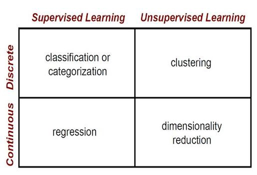
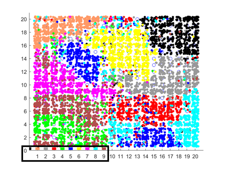
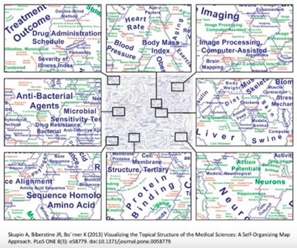

# Machine Learning Overview #

## Introduction to Machine Learning for Beginners ##

Examples of ML in use today:

- Prediction
  - Machine learning can also be used in the prediction systems. Considering the loan example, to compute the probability of a fault, the system will need to classify the available data in groups.
- Image Recognition
  - Machine learning can be used for face detection in an image as well. There is a separate category for each person in a database of several people.
- Speech Recognition
  - It is the translation of spoken words into the text. It is used in voice searches and more. Voice user interfaces include voice dialing, call routing, and appliance control. It can also be used a simple data entry and the preparation of structured documents.
- Medical diagnoses
  - ML is trained to recognize cancerous tissues.
- Financial industry and trading
  - Companies use ML in fraud investigations and credit checks.

**What is Machine Learning?**

- According to Arthur Samuel, Machine Learning algorithms enable the computers to learn from data, and even improve themselves, without being explicitly programmed.

- Types of Machine Learning?
  - Supervised Learning
    - In Supervised learning, an AI system is presented with data which is labeled, which means that each data tagged with the correct label.
	- The goal is to approximate the mapping function so well that when you have new input data (x) that you can predict the output variables (Y) for that data.
	- Types of Supervised Learning
	  - Classification: A classification problem is when the output variable is a category, such as “red” or “blue” or “disease” and “no disease”.
	  - Regression: A regression problem is when the output variable is a real value, such as “dollars” or “weight”.
  - Unsupervised Learning
    - In unsupervised learning, an AI system is presented with unlabeled, uncategorized data and the system’s algorithms act on the data without prior training.
	- Types of Unsupervised Learning
	  - Clustering: A clustering problem is where you want to discover the inherent groupings in the data, such as grouping customers by purchasing behavior.
	  - Association: An association rule learning problem is where you want to discover rules that describe large portions of your data, such as people that buy X also tend to buy Y.
  - Reinforcement Learning
    - A reinforcement learning algorithm, or agent, learns by interacting with its environment. The agent receives rewards by performing correctly and penalties for performing incorrectly. The agent learns without intervention from a human by maximizing its reward and minimizing its penalty.
	- It is basically leveraging the rewards obtained, the agent improves its environment knowledge to select the next action.

## Supervised Learning vs Unsupervised Learning ##

The main difference:

- Supervised learning is done using a **ground** truth, or in other words, we have prior knowledge of what the output values for our samples should be.
  - Therefore, the goal of supervised learning is to learn a function that, given a sample of data and desired outputs, best approximates the relationship between input and output observable in the data.
- Unsupervised learning, on the other hand, does not have labeled outputs, so its goal is to infer the natural structure present within a set of data points.

**Supervised Learning**

- Supervised learning is typically done in the context of classification, when we want to map input to output labels, or regression, when we want to map input to a continuous output.
  - Common Algorithms
  - logistic regression
	- naive bayes
	- support vector machines
	- artifical neural networks
	- random forests

- When conducting supervised learning, the main considerations are model complexity, and the bias-variance tradeoff. Note that both of these are interrelated.
  - If you have a small amount of data, or if your data is not uniformly spread throughout different possible scenarios, you should opt for a low-complexity model.
    - This is because a high-complexity model will overfit if used on a small number of data points.
	  - Overfitting refers to learning a function that fits your training data very well, but does not generalize to other data points — in other words, you are strictly learning to produce your training data without learning the actual trend or structure in the data that leads to this output.
  - In any model, there is a balance between bias, which is the constant error term, and variance, which is the amount by which the error may vary between different training sets.
    - So, high bias and low variance would be a model that is consistently wrong 20% of the time, whereas a low bias and high variance model would be a model that can be wrong anywhere from 5%-50% of the time, depending on the data used to train it.
	- Note that bias and variance typically move in opposite directions of each other; increasing bias will usually lead to lower variance, and vice versa.
    - Small, simple data-sets should usually be learned with low-variance models, and large, complex data-sets will often require higher-variance models to fully learn the structure of the data.

**Unsupervised Learning**

- Unsupervised learning is used to learn the inherent structure of our data without using explicitly-provided labels.
  - The most common tasks are clustering, representation learning, and density estimation.
  - Some common algorithms include k-means clustering, principal component analysis, and autoencoders.

- Two common use-cases for unsupervised learning are exploratory analysis and dimensionality reduction.  
  - Unsupervised learning is very useful in exploratory analysis because it can automatically identify structure in data.
  - Dimensionality reduction, which refers to the methods used to represent data using less columns or features.

TLDR:

## Batch vs. Online Learning ##

Batch Learning

- An ML algorithm suited to if the system can't learn from an incrementalist approach and requires all of the available data.
  - This is very resource intensive and therefore is taken offline.
  - The system is trained, then launched, at which point it stops learning anything more.
    - If new data is acquired after launching, a new system must be trained to replace the prior one.
	- Often, you'll need your ML algorithm to respond to changes in vast quantities of data in real-time. It can be quite costly to make a fresh Batch system from this data every day.
  - You have a relatively high amount of control over the quality of the data your system learns on.

Online Learning

- An ML algorithm that trains the system using small groups of data that're fed over a longer period of time.
  - The training is broken up into cheap and fast steps that allows for receiving data in real-time.
  - Online learning systems can also adapt quickly, even with limited computational power.
  - Learning rate: the speed with which the system adapts to changing data.
    - If you make this value too high, your system will quickly adapt to the new data at the expense of learning done on previous data.
	- If you set it too low, it will learn about the new data too slowly to be effective.
  - We must also be careful about the possibility, with Online Learning, that the system's performance is slowed by low-quality data being fed to it unbeknownst to us.
    - you snooze, you lose (or your model does)!

## Online Machine Learning ##

Online Learning AKA incremental or out-of-core learning.

- Python Libraries
  - [Vowpal Wabbit](https://github.com/VowpalWabbit/vowpal_wabbit)
  - [creme](https://creme-ml.github.io/) (scikit-inspired)

- In a general sense, you need two things for machine learning: data and a suitable learning algorithm.
  - The learning algorithm learns from/trains on your data and produces a (hopefully) accurate model, typically used for prediction on new data.

- If we just train a model once and never touch it again, we’re missing out the information more data could provide us.
  - Online shopping is one such environment: a product that is popular today may be all but forgotten tomorrow.

- In order to react to new data and make an AI that learns over time, ML practitioners typically do one of two things:
  1. They manually train on newer data, and deploy the resulting model once they are happy with its performance
  2. They schedule training on new data to take place, say, once a week and automatically deploy the resulting model

- Ideally, what you want is a model that can learn from new examples in something close to real time. Not only predict in real time, but learn in real time, too.

- scikit-learn
  - For regression problems, I usually start with the SGDRegressor class.

	  import numpy as np
	  from sklearn import linear_model

	  n_samples, n_features = 10, 5
	  y = np.random.randn(n_samples)
	  X = np.random.randn(n_samples, n_features)
	  clf = linear_model.SGDRegressor()
	  clf.fit(X, y)

  - The fit() method does all the training magic, resulting in a model we can use for prediction (in this case, predicting on one example):

	  clf.predict(np.random.randn(1, n_features))

  - SGDRegressor also provides a partial_fit() method, so that you can incrementally train on small batches of data.

	  import numpy as np
	  from sklearn import linear_model

	  n_samples, n_features = 1, 500
	  y = np.random.randn(n_samples)
	  X = np.random.randn(n_samples, n_features)
	  clf = linear_model.SGDRegressor()

	  import time

	  start_time = time.time()
	  clf.partial_fit(X, y)
	  elapsed_time = time.time() - start_time
	  print(elapsed_time)
	  >>> 0.0008502006530761719

- Therein lies the potential of online learning: the second we see a new example, let’s learn from it as fast as we can. The faster, the better.
  - In fact, because speed trumps everything else in online learning, we typically use simple learning algorithms over complex ones like neural networks.
  - We strive for millisecond-level learning; everything else comes second.

- Online learning is prone to catastrophic interference — more so than most other techniques.
  - https://en.wikipedia.org/wiki/Catastrophic_interference

- Learning immediately also requires fast access to new data.
  - If something is not available client-side, you need to be able to grab that data from somewhere in milliseconds.
    - Typically, that means using an in-memory store like Redis.

- If you fancy playing around with the (admittedly simple) code in this post, it’s available as a GitHub gist: https://gist.github.com/maxpagels/b9c9001f7e5b28a5742b81b02f7704e2

## ML Algorithms: One SD (σ)- Instance-based Algorithms ##

**Which algorithm is better for a specific task, and which one should I use?**

- Instance-based Algorithms: These algorithms don’t perform explicit generalization, instead they compare new problem instances with instances seen in training, which have been stored in memory.

  - K-Nearest Neighbor (KNN)
    - Can be used for both classification and regression problems.
	- KNN stores all available cases and classifies new cases by a majority vote of its K neighbors.
	- Predictions are made for a new data point by searching through the entire training set for the K most similar instances (the neighbors) and summarizing the output variable for those K instances.
	  - For instance, if we take K=3 and we want to decide which class does a new example belongs to, we consider the 3 closest (Euclidian distance usually) points to the new example.
	- Some things to consider:
	  - Choosing the optimal value for K is best done by first inspecting the data (you can use the elbow method).
	  - It is a supervised learning algorithm.

  - Learning Vector Quantization (LVQ)
    - Developed as a classification algorithm.
	- It is capable of supporting both binary (two-class) and multi-class classification problems.
	- The LVQ is an artificial neural network algorithm that allows you to choose how many training instances to hang onto and learns exactly what those instances should look like.
      - Unlike KNN which forces you to hang onto your entire training dataset.
	  - The value of the number of instances is optimized during learning process.
	- Some things to consider:
	  - It is a supervised learning algorithm
	  - If you discover that KNN gives good results on your dataset try using LVQ to reduce the memory requirements of storing the entire training dataset.

  - Self-Organizing Map (SOM)
    - An unsupervised deep learning model, mostly used for feature detection or dimensionality reduction.
	- SOM differ from other artificial neural networks as it apply competitive learning as opposed to error-correction learning (like back-propagation with gradient descent), and in the sense that they use a neighborhood function to preserve the topological properties of the input space.
	  - It produces a two dimensional representation of the input space of the set of training samples.
	    - For example, let’s look at the handwritten digits dataset. The inputs for SOM are high dimensional since each input dimension represents the grayscale value of one pixel on a 28 by 28 image, which makes the inputs 784-dimensional (each dimension is a value between 0 and 255). If we’ll map them to a 20x20 SOM and color them based on their true class (a number from 0 to 9) we’ll get the following:

		  

	- Another example of SOM is NLP.
	  - We can use it for a classification of let’s say 2 million medical papers. SOM will create a cluster of similar meaning words:

	    

	- Some things to consider:
	  - SOM outputs a 2D map for any number of indicators.
	  - We could use the SOM for clustering data without knowing the class memberships of the input data.

  - Locally Weighted Learning (LWL)
    - The basic idea behind LWL is that instead of building a global model for the whole function space, for each point of interest a local model is created based on neighboring data of the query point.
	- For this purpose, each data point becomes a weighting factor which expresses the influence of the data point for the prediction.
	- In general, data points which are in the close neighborhood to the current query point are receiving a higher weight than data points which are far away.
	- Some things to consider:
	  - LWL methods are non-parametric.
